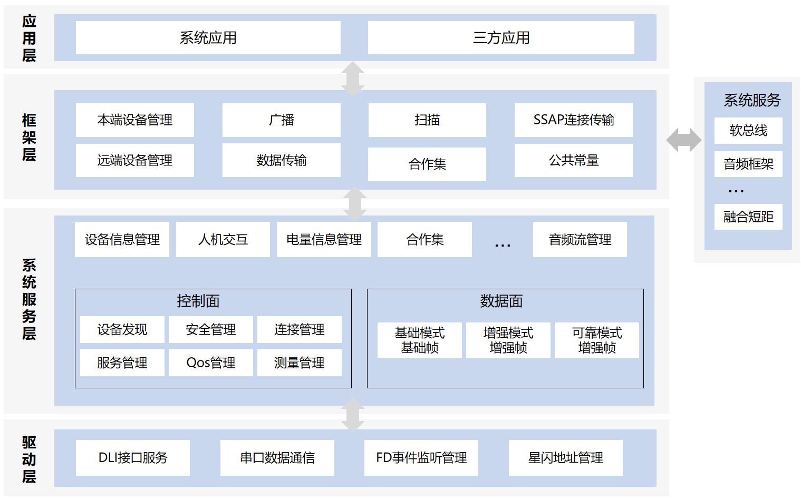

# 星闪服务

## 简介

星闪（NearLink）是一种新一代短距无线连接技术，具有低功耗、高可靠、低时延等特点，
广泛应用于智能家居、智能出行、智能终端等领域，参见[星闪联盟官网](https://www.isla.org.cn/)。

星闪服务组件是 OpenHarmony 系统中提供星闪无线通信能力的系统服务，为设备提供接入与使用星闪基础功能的相关接口，主要功能包括：

- **设备发现**：提供扫描与广播能力，支持设备快速发现与配对
- **连接管理**：提供设备连接建立、维护与断开的全生命周期管理
- **服务化数据交互**：基于 SSAP（SparkLink Service Access Protocol）属性协议的服务发现框架，支持服务端/客户端模式，
  实现设备间属性读写与通知


### 系统框架

星闪服务采用分层架构设计，自上而下分为应用层、框架层、系统服务层和驱动层。应用层通过 ArkTS API 或 C++ Inner API 接入；框架层提供统一的接口封装；系统服务层实现核心业务逻辑；驱动层负责与硬件芯片交互。各层通过标准化接口实现解耦，确保系统的可维护性和可扩展性。



#### 模块功能说明

整体架构划分为应用层、框架层、系统服务层和驱动层。

- **应用层**
  * **北向应用**：settings、systemUI、生态应用等，通过 ArkTS API 调用星闪能力。
  * **Native 服务**：其他系统服务通过 Inner API (C++) 调用星闪能力。

- **框架层**
  * **ArkTS APIs**：通过 [Connectivity Kit](https://gitee.com/openharmony/docs/blob/master/zh-cn/application-dev/connectivity/Readme-CN.md) 提供本端设备管理，远端设备发现、连接、管理等 ArkTS 接口。
  * **Inner API**：提供 NearlinkHost API、SleAdvertiser API、SsapServer API 等 C++ 接口，为其他系统服务（SA）提供星闪设备管理、广播控制、服务发现等核心能力。

- **系统服务层**
  * **基础能力**：提供设备信息管理与状态维护、人机交互与协同操作、电量信息监控与管理、合作集设备发现与组网、音频流管理与传输等原子能力封装，为上层应用提供统一、可复用的基础服务接口。
  * **控制面**：提供设备发现与配对、安全认证与密钥管理、连接建立与维护、服务发现与注册、QoS 策略控制等完整的控制面功能。
  * **数据面**：提供基础帧传输、基础模式低时延通信、流模式高速数据交互、增强模式可靠传输、可靠模式数据保证等完整的数据面功能，满足低时延、高吞吐、强可靠等多场景数据传输需求。

- **驱动层**
  * **DLI（Data Link Interface）接口服务**：提供设备逻辑层接口封装，实现上层服务与底层芯片之间的高效通信与指令交互。
  * **串口数据通信**：基于 UART 串口实现与星闪芯片的全双工数据传输，保障命令下发与数据上报的可靠性和实时性。
  * **FD 事件监听管理**：通过文件描述符事件驱动模型，实现对芯片异步事件、数据到达及异常状态的高效监听与分发处理。
  * **星闪地址管理**：负责设备星闪地址的生成、分配、维护与查询，确保设备间寻址与身份标识的唯一性和正确性。

## 目录

```
/foundation/communication/nearlink
├── interfaces                               # 模块对外提供接口文件
│    └── inner_api                           # 内部接口
├── frameworks                               # 框架层代码目录
│    ├── js                                  # JS框架代码
│    ├── native                              # Native框架代码
├── sa_profile                               # 星闪服务定义目录
├── services                                 # 星闪服务代码目录
│    ├── server                              # 服务端入口IPC消息分发
│    ├── service                             # 基础服务
│    ├── stack                               # 协议栈
│    ├── hardware                            # 驱动服务适配
│    ├── common                              # 通用工具模块
├── test                                     # 测试
│    ├── unittest                            # TDD测试
│    └── fuzztest                            # FUZZ测试
└── LICENSE                                  # 版权声明文件
└── bundle.json                              # 部件描述文件
```

## 约束

- **硬件依赖约束**：设备硬件必须集成支持[星闪（NearLink）协议](https://www.isla.org.cn/trial?page=1&sort=)的无线通信芯片，且芯片需支持 NearLink E1.0 及以上协议规范，否则无法使用星闪相关能力
- **系统适配约束**：当前本部件仅支持 OpenHarmony 标准系统（Standard System），需配套完整系统服务框架使用
- **产品配置约束**：需在产品部件声明中引入 `nearlink_service` 部件，否则本部件不会参与编译与系统镜像打包；产品配置中需设置 `const.nearlink.enable = 1`，否则星闪能力不会开启
- **规格能力约束**：当前开源版本仅支持 SLE 低功耗接入模式，其它模式暂不支持。单设备同时支持的连接数、测距精度等能力因芯片规格及业务并发度而异，不同厂商芯片实现存在差异

## 编译构建

### 编译

根据不同的目标平台，使用以下命令进行编译：

- **全量编译**

    修改build.gn文件后编译命令
    ```
    $ ./build.sh --product-name {product_name} --ccache
    ```
    未修改build.gn文件编译命令
    ```
    $ ./build.sh --product-name {product_name} --ccache --fast-rebuild
    ```

- **部件独立编译**

    ```
    $ ./build.sh --product-name {product_name} --ccache --build-target nearlink_service
    ```

> **说明：** {product_name} 为当前支持的平台名称。

### 可配置特性

本部件支持通过产品配置文件按需裁剪功能，所有特性开关默认值如下。

| 特性名称 | 默认值 | 功能说明 | 适用系统 |
|---------|--------|---------|---------|
| nearlink_service_kia_enable | false | KIA（key information assets）场景禁用星闪数据传输 | 标准系统 |
| nearlink_service_edm_enable | false | EDM（Enterprise Device Management）企业管控场景禁用星闪功能 | 标准系统 |
| nearlink_service_rss_background_task | false | 后台任务支持，资源调度服务集成 | 标准系统 |
| nearlink_service_bas_enable | false | BAS（Battery Management Service）电量管理服务 | 标准系统 |
| nearlink_service_power_manager_enhance | false | 电源管理增强，优化功耗策略 | 标准系统 |
| nearlink_service_host_dynamic_running | false | 驱动进程动态加/卸载 | 标准系统 |
| nearlink_service_host_avoid_sleep | false | 避免休眠，保持服务活跃 | 标准系统 |
| nearlink_service_no_pairing_dialog | false | 免配对弹框，通过其它方式鉴权 | 标准系统 |
| nearlink_service_pluggable_supported | false | 可插拔支持，动态加载/卸载模块 | 标准系统/小型系统 |

产品可在 `vendor/{厂商}/{产品}/config.json` 中覆盖配置，参考[部件化编译最佳实践](https://gitcode.com/openharmony/build/blob/master/docs/%E9%83%A8%E4%BB%B6%E5%8C%96%E7%BC%96%E8%AF%91%E6%9C%80%E4%BD%B3%E5%AE%9E%E8%B7%B5.md)。

配置示例（例如需要打开EDM能力）：

> ```json
> {
>   "component": {
>     "name": "nearlink_service",
>     "subsystem": "communication",
>     "features": [
>       "nearlink_service_edm_enable=true"
>     ]
>   }
> }
> ```

## 使用说明

本章介绍星闪核心模块的使用方法，涵盖星闪开关、星闪广播和星闪扫描等功能，分别提供 Native 侧（C++）和应用侧（ArkTS）的标准调用示例。

### Native侧使用说明

以下是星闪核心模块的 Native 侧标准写法。Native 侧通过 C++ Inner API 为其他系统服务提供星闪能力接入，接口定义于 `interfaces/inner_api/include/` 目录下的头文件中，涵盖星闪开关控制、设备广播与扫描等核心功能。

### 星闪开关

提供星闪开关的启停控制、状态查询与状态变化监听能力，采用全局单例模式，核心接口定义于 `nearlink_host.h` 头文件。

**接口说明**

| 接口 | 功能说明 |
|------|----------|
| `NearlinkHost::GetInstance()` | 获取星闪主机管理类全局单例实例 |
| `EnableNl(AutoConnPolicy policy = AUTO_CONN_GENERAL)` | 开启星闪功能；可通过 `policy` 参数配置自动回连策略，默认采用正常自动回连模式 |
| `DisableNl()` | 关闭星闪功能 |
| `IsSleEnabled()` | 查询星闪 SLE 低功耗模式是否开启，返回布尔值 |
| `GetSleFullState()` | 获取星闪完整运行状态，返回 `SleStateID` 枚举值 |
| `IsNearlinkSupport()` | 检测设备硬件是否支持星闪协议 |
| `RegisterObserver(const std::shared_ptr<NearlinkHostObserver> &observer)` | 注册星闪状态变化观察者，监听状态变更事件 |
| `DeregisterObserver(const std::shared_ptr<NearlinkHostObserver> &observer)` | 注销已注册的状态变化观察者 |

自动回连策略枚举：
- `AUTO_CONN_GENERAL`：正常自动回连（默认值）
- `AUTO_CONN_EXCEPT_AUDIO_DEVICES`：不自动回连音频类设备
- `AUTO_CONN_EXCEPT_USER_DISCONNECTED_DEVICES`：不自动回连用户主动断开的设备

**调用示例**
```cpp
#include "nearlink_host.h"
#include <memory>

// 自定义状态观察者，继承基类并重写回调方法
class DemoHostObserver : public Nearlink::NearlinkHostObserver {
public:
    void OnStateChanged(int transport, int status) override
    {
        // 自定义状态变化处理逻辑
        // transport 对应传输类型，status 对应开关状态枚举
    }
};

void NearlinkSwitchDemo()
{
    // 获取全局单例
    auto &host = Nearlink::NearlinkHost::GetInstance();

    // 前置校验：检测硬件支持性
    if (!host.IsNearlinkSupport()) {
        // 设备不支持星闪，异常退出
        return;
    }

    // 注册状态变化观察者
    auto observer = std::make_shared<DemoHostObserver>();
    host.RegisterObserver(observer);

    // 开启星闪，使用默认自动回连策略
    NlErrCode ret = host.EnableNl();
    if (ret != NL_NO_ERROR) {
        // 开启失败，根据错误码处理异常
        return;
    }

    // 查询当前开关状态
    bool isEnabled = host.IsSleEnabled();

    // 关闭星闪
    ret = host.DisableNl();
    if (ret != NL_NO_ERROR) {
        // 关闭失败处理
    }

    // 注销观察者，释放监听资源
    host.DeregisterObserver(observer);
}
```
#### 星闪广播

提供星闪广播的开启与停止能力，支持自定义广播参数、广播数据与扫描响应数据，核心接口定义于 `nearlink_sle_advertiser.h` 头文件。

**接口说明**

| 接口                                            | 功能说明 |
|-------------------------------------------------|----------|
| `SleAdvertiser::CreateSleAdvertiser()`          | 创建广播实例，工厂方法 |
| `StartAdvertising(settings, advData, scanResponse, duration, callback)` | 开启广播；`settings` 为广播参数，`advData` 为广播数据，`scanResponse` 为扫描响应数据，`duration` 为广播持续时间（单位 10ms，0 表示持续广播），`callback` 为结果回调 |
| `StopAdvertising(callback)`                     | 停止广播（按回调对象匹配） |
| `StopAdvertising(advHandle)`                    | 停止广播（按广播句柄） |
| `EnableAdvertising(advHandle)`                  | 启用指定广播集 |
| `DisableAdvertising(advHandle)`                 | 禁用指定广播集 |
| `SetAdvertisingData(advData, scanResponse, callback)` | 动态更新广播数据与扫描响应数据 |
| `GetAdvHandle(callback, advHandle)`             | 获取广播句柄 |

广播参数类 `SleAdvertiserSettings`：

| 接口                                          | 功能说明           |
|-----------------------------------------------|--------------------|
| `SetConnectable(bool)`                        | 设置是否可连接     |
| `SetInterval(uint32_t)`                       | 设置广播间隔       |
| `SetTxPower(uint8_t)`                         | 设置发射功率       |
| `SetPrimaryPhy(int)` / `SetSecondaryPhy(int)` | 设置主/副 PHY 类型 |
| `SetLegacyMode(bool)`                         | 设置是否为兼容模式 |

广播数据类 `SleAdvertiserData`：

| 接口                               | 功能说明                         |
|------------------------------------|----------------------------------|
| `AddServiceData(uuid, data)`       | 添加服务数据                     |
| `AddManufacturerData(id, data)`    | 添加厂商自定义数据               |
| `AddServiceUuid(uuid)`             | 添加服务 UUID                    |
| `SetIncludeDeviceName(bool)`       | 设置是否在广播中包含设备名       |

回调接口 `SleAdvertiseCallback`（需继承并重写）：

| 接口                                  | 功能说明                         |
|---------------------------------------|----------------------------------|
| `OnStartResultEvent(result, advHandle)` | 开启广播结果回调（必须重写）   |
| `OnStopResultEvent(result, advHandle)`  | 停止广播结果回调               |
| `OnSetAdvDataEvent(result)`             | 更新广播数据结果回调（必须重写） |

**调用示例**

```cpp
#include "nearlink_sle_advertiser.h"
#include "nearlink_uuid.h"
#include <memory>

using namespace OHOS::Nearlink;

// 自定义广播回调，继承基类并重写回调方法
class DemoAdvertiseCallback : public SleAdvertiseCallback {
public:
    void OnStartResultEvent(int result, int advHandle) override
    {
        if (result == 0) {
            // 广播开启成功，advHandle 为广播句柄
        } else {
            // 广播开启失败，根据错误码处理异常
        }
    }

    void OnStopResultEvent(int result, int advHandle) override
    {
        // 广播已停止
    }

    void OnSetAdvDataEvent(int result) override
    {
        // 广播数据更新结果
    }
};

void NearlinkAdvertiseDemo()
{
    // 步骤一：创建广播实例
    auto advertiser = SleAdvertiser::CreateSleAdvertiser();

    // 步骤二：配置广播参数
    SleAdvertiserSettings settings;
    settings.SetConnectable(true);       // 设置为可连接广播
    settings.SetInterval(0x1388);        // 设置广播间隔（5000 * 0.625ms）
    settings.SetTxPower(SLE_ADV_TX_POWER_MEDIUM);  // 设置发射功率

    // 步骤三：构造广播数据
    SleAdvertiserData advData;
    UUID serviceUuid;
    serviceUuid.FromString("37bea880-fc70-11ea-b720-000000001234");
    advData.AddServiceUuid(serviceUuid);
    advData.AddServiceData(serviceUuid, "hello");
    advData.AddManufacturerData(0x027d, "vendor_data");
    advData.SetIncludeDeviceName(true);

    // 步骤四：构造扫描响应数据
    SleAdvertiserData scanResponse;
    scanResponse.SetIncludeDeviceName(true);

    // 步骤五：创建回调并开启广播
    auto callback = std::make_shared<DemoAdvertiseCallback>();
    uint16_t duration = 0;  // 0 表示持续广播
    NlErrCode ret = advertiser->StartAdvertising(settings, advData, scanResponse, duration, callback);
    if (ret != NL_NO_ERROR) {
        // 开启失败，根据错误码处理异常
        return;
    }

    // 步骤六：停止广播
    ret = advertiser->StopAdvertising(callback);
    if (ret != NL_NO_ERROR) {
        // 停止失败处理
    }
}
```

**说明**

- `SleAdvertiser` 通过工厂方法 `CreateSleAdvertiser()` 创建，生命周期由调用方管理。
- `duration` 参数单位为 10ms，设置为 0 表示持续广播直到主动停止。
- 错误码完整定义见 `nearlink_errorcode.h` 头文件。

#### 星闪扫描

提供星闪设备扫描与发现能力，支持全量扫描和带过滤条件的扫描，核心接口定义于 `nearlink_sle_scanner.h` 头文件。

**接口说明**

| 接口                                            | 功能说明 |
|-------------------------------------------------|----------|
| `SleCentralManager::CreateSleCentralManager(callback)` | 创建扫描管理器实例，工厂方法 |
| `StartScan()`                                   | 使用默认参数开启扫描 |
| `StartFullScan(settings)`                       | 开启全量扫描，扫描所有可见设备 |
| `StartScanWithFilter(settings, filters)`        | 开启带过滤条件的扫描，仅上报匹配的设备 |
| `StopScan()`                                    | 停止扫描 |

扫描参数类 `SleScanSettings`：

| 接口                               | 功能说明 |
|------------------------------------|----------|
| `SetScanMode(int)`                 | 设置扫描模式（`SCAN_MODE` 枚举） |
| `SetDuration(int)`                 | 设置扫描时长（10-60s） |
| `SetReportDelay(long)`             | 设置批量上报延迟时间 |
| `SetFrameType(uint8_t)`            | 设置帧类型 |

过滤类 `SleScanFilter`：

| 接口                               | 功能说明                         |
|------------------------------------|----------------------------------|
| `SetDeviceId(string)`              | 按设备地址过滤                   |
| `SetName(string)`                  | 按设备名称过滤                   |
| `SetServiceUuid(UUID)`             | 按服务 UUID 过滤                 |
| `SetManufacturerId(uint16_t)`      | 按厂商 ID 过滤                   |
| `SetRssiThreshold(int8_t)`         | 按 RSSI 阈值过滤                 |

结果类 `SleScanResult`：

| 接口                               | 功能说明                         |
|------------------------------------|----------------------------------|
| `GetPeripheralDevice()`            | 获取远端设备信息                 |
| `GetRssi()`                        | 获取信号强度                     |
| `GetServiceUuids()`                | 获取服务 UUID 列表               |
| `GetManufacturerData()`            | 获取厂商数据                     |
| `GetServiceData()`                 | 获取服务数据                     |
| `IsConnectable()`                  | 判断设备是否可连接               |

回调接口 `SleCentralManagerCallback`（需继承并重写）：

| 接口                                  | 功能说明                         |
|---------------------------------------|----------------------------------|
| `OnScanCallback(result)`              | 单条扫描结果回调（必须重写）     |
| `OnStartOrStopScanEvent(resultCode, isStartScan)` | 开启/停止扫描结果回调 |

**调用示例**

```cpp
#include "nearlink_sle_scanner.h"
#include "nearlink_uuid.h"
#include <memory>

using namespace OHOS::Nearlink;

// 自定义扫描回调，继承基类并重写回调方法
class DemoScanCallback : public SleCentralManagerCallback {
public:
    void OnScanCallback(const SleScanResult &result) override
    {
        // 获取扫描到的设备信息
        auto device = result.GetPeripheralDevice();
        int8_t rssi = result.GetRssi();
        bool connectable = result.IsConnectable();
        
        // 处理扫描结果
    }

    void OnStartOrStopScanEvent(int resultCode, bool isStartScan) override
    {
        if (isStartScan) {
            if (resultCode == 0) {
                // 扫描开启成功
            } else {
                // 扫描开启失败
            }
        } else {
            // 扫描已停止
        }
    }
};

void NearlinkScanDemo()
{
    // 步骤一：创建扫描回调
    auto callback = std::make_shared<DemoScanCallback>();

    // 步骤二：创建扫描管理器
    auto scanner = SleCentralManager::CreateSleCentralManager(callback);

    // 步骤三：配置扫描参数
    SleScanSettings settings;
    settings.SetScanMode(SCAN_MODE_LOW_LATENCY);  // 低延迟扫描模式
    settings.SetDuration(30);                      // 扫描时长 30 秒

    // 步骤四（可选）：配置过滤条件
    std::vector<SleScanFilter> filters;
    SleScanFilter filter;
    UUID serviceUuid;
    serviceUuid.FromString("37bea880-fc70-11ea-b720-000000001234");
    filter.SetServiceUuid(serviceUuid);            // 只扫描包含指定服务 UUID 的设备
    filter.SetRssiThreshold(-70);                  // 只扫描信号强度大于 -70dBm 的设备
    filters.push_back(filter);

    // 步骤五：开启扫描（方式一：全量扫描）
    NlErrCode ret = scanner->StartFullScan(settings);
    
    // 或开启扫描（方式二：带过滤条件扫描）
    // NlErrCode ret = scanner->StartScanWithFilter(settings, filters);
    
    if (ret != NL_NO_ERROR) {
        // 开启扫描失败，根据错误码处理异常
        return;
    }

    // 步骤六：停止扫描
    ret = scanner->StopScan();
    if (ret != NL_NO_ERROR) {
        // 停止扫描失败处理
    }
}
```

**说明**

- `SleCentralManager` 通过工厂方法 `CreateSleCentralManager()` 创建，生命周期由调用方管理。
- `SCAN_MODE` 枚举包括：`SCAN_MODE_LOW_POWER`（低功耗）、`SCAN_MODE_BALANCED`（平衡模式）、`SCAN_MODE_LOW_LATENCY`（低延迟）等。
- 过滤条件支持多个 `SleScanFilter`，多个过滤条件之间为或关系。
- 错误码完整定义见 `nearlink_errorcode.h` 头文件。

### 应用侧使用说明

以下是星闪核心模块的应用侧（ArkTS）标准写法。通过 [@kit.ConnectivityKit](https://gitee.com/openharmony/docs/blob/master/zh-cn/application-dev/connectivity/Readme-CN.md) 提供的 ArkTS 接口，应用开发者可以快速集成星闪功能，实现设备发现、连接管理、数据传输等核心能力。

> **重要提示：** 使用星闪 ArkTS 能力前，必须先通过 `manager.isNearLinkSupported()` 接口查询当前设备是否支持星闪，若不支持则不应调用后续星闪相关接口。

#### 星闪能力查询

提供设备星闪能力支持性查询，用于在调用任何星闪接口前确认当前设备是否具备星闪硬件与系统支持，通过 [@kit.ConnectivityKit](https://gitee.com/openharmony/docs/blob/master/zh-cn/application-dev/connectivity/Readme-CN.md) 中的 `manager` 模块提供。

**接口说明**

| 接口 | 功能说明 |
|------|----------|
| `manager.isNearLinkSupported()` | 查询当前设备是否支持星闪能力，返回布尔值。`true` 表示支持，`false` 表示不支持 |

**调用示例**

```typescript
import { manager } from '@kit.ConnectivityKit';

// 查询当前设备是否支持星闪
let isSupported: boolean = manager.isNearLinkSupported();
if (isSupported) {
  // 设备支持星闪，可继续调用星闪相关接口
  console.info('当前设备支持星闪');
} else {
  // 设备不支持星闪，不应调用任何星闪相关接口
  console.info('当前设备不支持星闪');
}
```

**说明**

- 该接口为同步调用，无需权限申请。
- 底层通过系统属性 `const.nearlink.enable` 判断设备是否具备星闪能力。
- 在应用业务代码中，应先调用此接口进行前置校验，否则在不支持星闪的设备上调用其它接口可能会出现抛出错误码或者其它异常情况。

#### 星闪开关

提供星闪开关的启停控制、状态查询与状态变化监听能力，通过 [@kit.ConnectivityKit](https://gitee.com/openharmony/docs/blob/master/zh-cn/application-dev/connectivity/Readme-CN.md) 中的 `manager` 模块提供。

**接口说明**

| 接口 | 功能说明 |
|------|----------|
| `manager.getState()` | 获取当前星闪开关状态，返回 `manager.NearlinkState` 枚举值 |
| `manager.enableNearlink()` | 开启星闪开关 |
| `manager.disableNearlink()` | 关闭星闪开关 |
| `manager.on('stateChange', callback)` | 订阅星闪开关状态变化事件 |
| `manager.off('stateChange', callback)` | 取消订阅星闪开关状态变化事件 |

状态枚举 `manager.NearlinkState`：
| 枚举值 | 功能说明 |
|--------|----------|
| `STATE_ON` | 星闪开关已开启 |
| `STATE_OFF` | 星闪开关已关闭 |
| `STATE_TURNING_ON` | 星闪开关正在开启 |
| `STATE_TURNING_OFF` | 星闪开关正在关闭 |

**调用示例**

```typescript
import { manager } from '@kit.ConnectivityKit';
import { BusinessError } from '@kit.BasicServicesKit';

// 步骤一：查询当前星闪开关状态
try {
  let state: manager.NearlinkState = manager.getState();
  console.info('当前星闪状态: ' + JSON.stringify(state));
} catch (err) {
  console.error('查询失败, errCode: ' + (err as BusinessError).code + ', errMessage: ' + (err as BusinessError).message);
}

// 步骤二：订阅星闪开关状态变化
let onStateChange: (data: manager.NearlinkState) => void = (data: manager.NearlinkState) => {
  console.info('星闪状态变化: ' + JSON.stringify(data));
  // 根据状态变化实现业务逻辑
};
try {
  manager.on('stateChange', onStateChange);
} catch (err) {
  console.error('订阅失败, errCode: ' + (err as BusinessError).code + ', errMessage: ' + (err as BusinessError).message);
}

// 步骤三：开启星闪开关
try {
  manager.enableNearlink();
} catch (err) {
  console.error('开启失败, errCode: ' + (err as BusinessError).code + ', errMessage: ' + (err as BusinessError).message);
}

// 步骤四：关闭星闪开关
try {
  manager.disableNearlink();
} catch (err) {
  console.error('关闭失败, errCode: ' + (err as BusinessError).code + ', errMessage: ' + (err as BusinessError).message);
}

// 步骤五：取消订阅星闪开关状态变化
try {
  manager.off('stateChange', onStateChange);
} catch (err) {
  console.error('取消订阅失败, errCode: ' + (err as BusinessError).code + ', errMessage: ' + (err as BusinessError).message);
}
```

#### 星闪广播

提供星闪广播的开启与停止能力，支持自定义广播参数与广播数据，通过 [@kit.ConnectivityKit](https://gitee.com/openharmony/docs/blob/master/zh-cn/application-dev/connectivity/Readme-CN.md) 中的 `advertising` 模块提供。

**接口说明**

| 接口 | 功能说明 |
|------|----------|
| `advertising.startAdvertising(params)` | 开启广播；`params` 为广播参数配置，返回广播索引 `advertisingId` |
| `advertising.stopAdvertising(advertisingId)` | 停止广播；`advertisingId` 为开启广播时返回的索引 |
| `advertising.on('advertisingStateChange', callback)` | 订阅广播状态变化事件，广播状态变更时触发回调 |
| `advertising.off('advertisingStateChange', callback)` | 取消订阅广播状态变化事件 |

广播参数 `advertising.AdvertisingSettings`：
| 字段 | 功能说明 |
|------|----------|
| `interval` | 广播间隔 |
| `power` | 发射功率，取值 `advertising.TxPowerMode` 枚举 |

发射功率 `advertising.TxPowerMode`：
| 枚举值 | 功能说明 |
|--------|----------|
| `ADV_TX_POWER_ULTRA_LOW` | 超低功率 |
| `ADV_TX_POWER_LOW` | 低功率 |
| `ADV_TX_POWER_MEDIUM` | 中等功率 |
| `ADV_TX_POWER_HIGH` | 高功率 |

广播数据 `advertising.AdvertisingData`：
| 字段 | 功能说明 |
|------|----------|
| `serviceUuids` | 服务 UUID 列表 |
| `manufacturerData` | 厂商自定义数据列表 |
| `serviceData` | 服务数据列表 |

**调用示例**

```typescript
import { advertising } from '@kit.ConnectivityKit';
import { BusinessError } from '@kit.BasicServicesKit';

// 步骤一：订阅广播状态变化事件
let onAdvStateChange: (data: advertising.AdvertisingStateChangeInfo) => void =
  (data: advertising.AdvertisingStateChangeInfo) => {
    console.info('advertisingId: ' + data.advertisingId);
    console.info('advertisingState: ' + data.state);
    // 根据广播状态实现业务逻辑
  };
try {
  advertising.on('advertisingStateChange', onAdvStateChange);
} catch (err) {
  console.error('订阅失败, errCode: ' + (err as BusinessError).code + ', errMessage: ' + (err as BusinessError).message);
}

// 步骤二：构造广播参数
let setting: advertising.AdvertisingSettings = {
  interval: 5000,
  power: advertising.TxPowerMode.ADV_TX_POWER_LOW
};

// 步骤三：构造广播数据
let manufactureValueBuffer = new Uint8Array(4);
manufactureValueBuffer[0] = 1;
manufactureValueBuffer[1] = 2;
manufactureValueBuffer[2] = 3;
manufactureValueBuffer[3] = 4;
let manufactureDataUnit: advertising.ManufacturerData = {
  manufacturerId: 4567,
  manufacturerData: manufactureValueBuffer.buffer
};
let serviceValueBuffer = new Uint8Array(4);
serviceValueBuffer[0] = 4;
serviceValueBuffer[1] = 6;
serviceValueBuffer[2] = 7;
serviceValueBuffer[3] = 8;
let serviceDataUnit: advertising.ServiceData = {
  serviceUuid: '37bea880-fc70-11ea-b720-000000001234',
  serviceData: serviceValueBuffer.buffer
};
let advData: advertising.AdvertisingData = {
  serviceUuids: ['37bea880-fc70-11ea-b720-000000001234'],
  manufacturerData: [manufactureDataUnit],
  serviceData: [serviceDataUnit]
};
let advertisingParams: advertising.AdvertisingParams = {
  advertisingSettings: setting,
  advertisingData: advData
};

// 步骤四：开启广播
let advId = -1;
try {
  advertising.startAdvertising(advertisingParams).then((advertisingId: number) => {
    advId = advertisingId;
    console.info('开启广播成功, advertisingId: ' + advId);
  }).catch((err: BusinessError) => {
    console.error('开启广播失败, errCode: ' + err.code + ', errMessage: ' + err.message);
  });
} catch (err) {
  console.error('开启广播异常, errCode: ' + (err as BusinessError).code + ', errMessage: ' + (err as BusinessError).message);
}

// 步骤五：停止广播
try {
  advertising.stopAdvertising(advId).then(() => {
    console.info('停止广播成功');
  }).catch((err: BusinessError) => {
    console.error('停止广播失败, errCode: ' + err.code + ', errMessage: ' + err.message);
  });
} catch (err) {
  console.error('停止广播异常, errCode: ' + (err as BusinessError).code + ', errMessage: ' + (err as BusinessError).message);
}

// 步骤六：取消订阅广播状态变化事件
try {
  advertising.off('advertisingStateChange', onAdvStateChange);
} catch (err) {
  console.error('取消订阅失败, errCode: ' + (err as BusinessError).code + ', errMessage: ' + (err as BusinessError).message);
}
```

#### 星闪扫描

提供星闪设备的扫描与发现能力，支持全量扫描与带过滤条件的扫描，通过 [@kit.ConnectivityKit](https://gitee.com/openharmony/docs/blob/master/zh-cn/application-dev/connectivity/Readme-CN.md) 中的 `scan` 模块提供。

**接口说明**

| 接口 | 功能说明 |
|------|----------|
| `scan.startScan(filters, options)` | 开启扫描；`filters` 为扫描过滤条件列表（为空则全量扫描），`options` 为扫描参数配置 |
| `scan.stopScan()` | 停止扫描 |
| `scan.on('deviceFound', callback)` | 订阅扫描结果事件，扫描到外围设备时触发回调 |
| `scan.off('deviceFound', callback)` | 取消订阅扫描结果事件 |

扫描模式 `scan.ScanMode`：
| 枚举值 | 功能说明 |
|--------|----------|
| `SCAN_MODE_LOW_POWER` | 低功耗模式 |
| `SCAN_MODE_BALANCED` | 平衡模式 |
| `SCAN_MODE_LOW_LATENCY` | 低延迟模式 |

扫描结果 `scan.ScanResults`：
| 字段 | 功能说明 |
|------|----------|
| `address` | 远端设备地址 |
| `deviceName` | 远端设备名称 |
| `rssi` | 信号强度 |

**调用示例**

```typescript
import { scan } from '@kit.ConnectivityKit';
import { BusinessError } from '@kit.BasicServicesKit';

// 步骤一：定义扫描结果回调
let onDeviceFound: (data: Array<scan.ScanResults>) => void = (data: Array<scan.ScanResults>) => {
  console.info('扫描到设备, addr: ' + data[0].address + ', name: ' + data[0].deviceName);
  // 根据扫描结果实现业务逻辑
};

// 步骤二：订阅扫描结果
try {
  scan.on('deviceFound', onDeviceFound);
} catch (err) {
  console.error('订阅失败, errCode: ' + (err as BusinessError).code + ', errMessage: ' + (err as BusinessError).message);
}

// 步骤三：配置扫描参数
let scanOptions: scan.ScanOptions = {
  scanMode: scan.ScanMode.SCAN_MODE_LOW_POWER
};

// 步骤四：开启全量扫描
try {
  scan.startScan([], scanOptions).then(() => {
    console.info('开启扫描成功');
  }).catch((err: BusinessError) => {
    console.error('开启扫描失败, errCode: ' + err.code + ', errMessage: ' + err.message);
  });
} catch (err) {
  console.error('开启扫描异常, errCode: ' + (err as BusinessError).code + ', errMessage: ' + (err as BusinessError).message);
}

// 步骤五：停止扫描
try {
  scan.stopScan().then(() => {
    console.info('停止扫描成功');
  }).catch((err: BusinessError) => {
    console.error('停止扫描失败, errCode: ' + err.code + ', errMessage: ' + err.message);
  });
} catch (err) {
  console.error('停止扫描异常, errCode: ' + (err as BusinessError).code + ', errMessage: ' + (err as BusinessError).message);
}

// 步骤六：取消订阅扫描结果
try {
  scan.off('deviceFound', onDeviceFound);
} catch (err) {
  console.error('取消订阅失败, errCode: ' + (err as BusinessError).code + ', errMessage: ' + (err as BusinessError).message);
}
```

## 相关仓

[星闪服务](https://gitcode.com/openharmony-sig/communication_nearlink)

[星闪驱动服务](https://gitcode.com/openharmony/drivers_peripheral)
